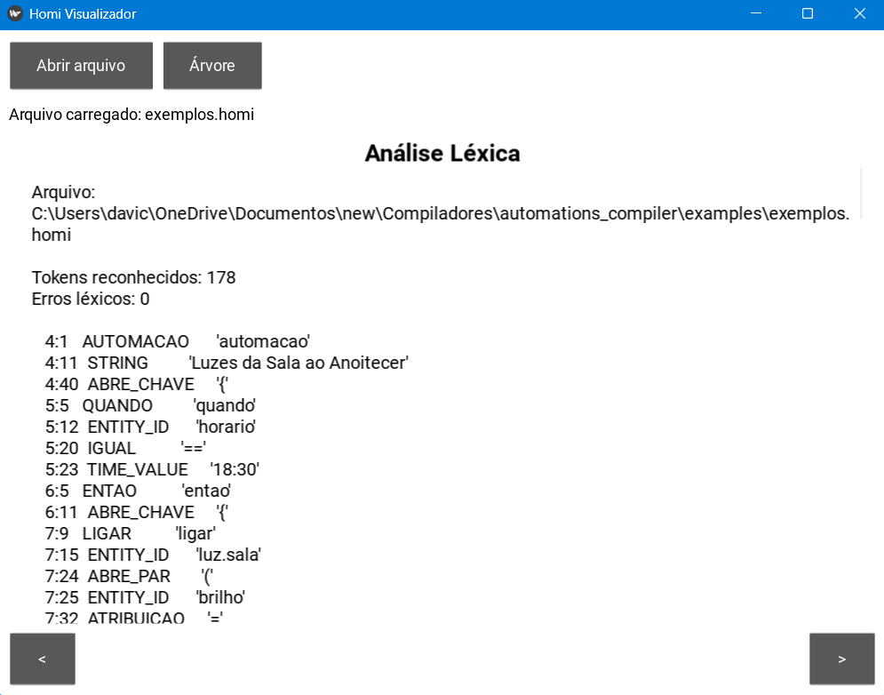
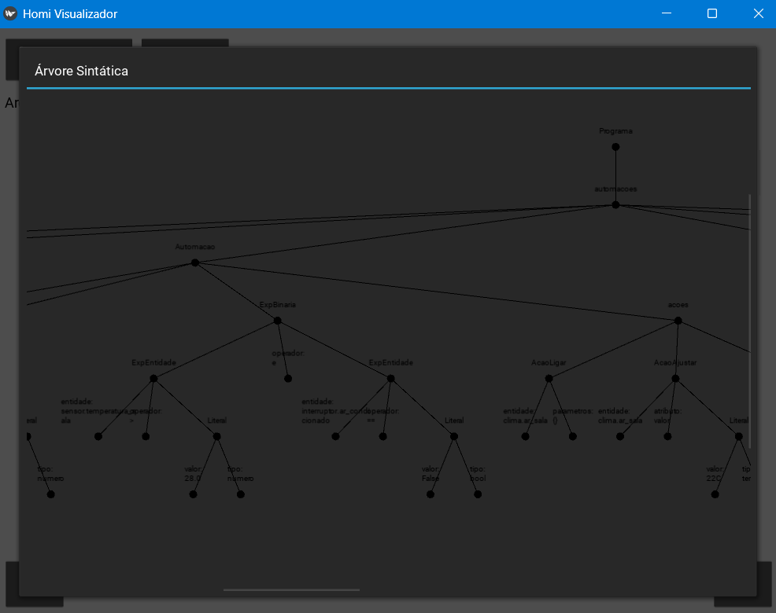

# Compilador de Automações para Home Assistant

## Como Usar

```bash
python homi.py meu_script.homi
```


### Exemplo de Script

```
automacao "Nome da Automação" {
    quando <gatilho>
    se <condição>          # opcional
    entao {
        <ações>
    }
}
```

**Ligar luzes ao anoitecer:**
```
automacao "Luzes da Sala ao Anoitecer" {
    quando horario == 18:30
    entao {
        ligar luz.sala (brilho = 80%);
        notificar "Luzes ligadas automaticamente.";
    }
}
```


---

## Gramática Livre de Contexto (GLC)

### Terminais

| Token | Padrão | Exemplo |
|-------|--------|---------|
| `ENTITY_ID` | `[a-z_]+\.[a-z_0-9]+` | `luz.sala`, `sensor.temp` |
| `NUMBER` | `[0-9]+(\.[0-9]+)?` | `25`, `18.5` |
| `STRING` | `"[^"]*"` | `"Bom dia!"` |
| `TIME_UNIT` | `[0-9]+(s\|min\|h)` | `10s`, `5min`, `2h` |
| `TIME_VALUE` | `[0-9]{2}:[0-9]{2}` | `08:00`, `22:30` |
| `TEMPERATURA` | `[0-9]+(\.[0-9]+)?C` | `22C`, `18.5C` |
| Palavras-chave | literais | `automacao`, `quando`, `se`... |
| Operadores | símbolos | `==`, `!=`, `>`, `<`, `>=`, `<=` |
| Delimitadores | símbolos | `{`, `}`, `(`, `)`, `;`, `,` |

### Produções (BNF)

```
programa        → automacao* EOF

automacao       → 'automacao' STRING '{' gatilho_sec cond_sec? acao_sec '}'

gatilho_sec     → 'quando' gatilho (';' gatilho)*
gatilho         → gatilho_estado | gatilho_horario | gatilho_sensor
gatilho_estado  → ENTITY_ID '==' (STRING | 'verdadeiro' | 'falso')
gatilho_horario → 'horario' '==' TIME_VALUE
               | 'horario' 'entre' TIME_VALUE 'e_hora' TIME_VALUE
gatilho_sensor  → ENTITY_ID operador_comp valor

cond_sec        → 'se' expressao

expressao       → exp_ou
exp_ou          → exp_e ('ou' exp_e)*
exp_e           → exp_nao ('e' exp_nao)*
exp_nao         → 'nao' exp_nao | exp_atom
exp_atom        → '(' expressao ')'
               | 'verdadeiro' | 'falso'
               | ENTITY_ID operador_comp valor
               | ENTITY_ID 'entre' TIME_VALUE 'e_hora' TIME_VALUE

acao_sec        → 'entao' '{' acao* '}'
acao            → acao_ligar | acao_desligar | acao_ajustar
               | acao_esperar | acao_notificar | acao_repetir
               | acao_cena | acao_se_entao

acao_ligar      → 'ligar' ENTITY_ID param_list? ';'
acao_desligar   → 'desligar' ENTITY_ID ';'
acao_ajustar    → 'ajustar' ENTITY_ID '=' valor ';'
acao_esperar    → 'esperar' TIME_UNIT ';'
acao_notificar  → 'notificar' STRING (',' ENTITY_ID)? ';'
acao_repetir    → 'repetir' NUMBER 'vezes' '{' acao* '}'
acao_cena       → 'ativar' 'cena' ENTITY_ID ';'
acao_se_entao   → 'se' expressao 'entao' '{' acao* '}'
                  ('senao' '{' acao* '}')? 'fim'

param_list      → '(' param (',' param)* ')'
param           → IDENT '=' valor

valor           → NUMBER '%'? | STRING | TIME_VALUE | TEMPERATURA
               | 'verdadeiro' | 'falso' | ENTITY_ID

operador_comp   → '==' | '!=' | '>' | '<' | '>=' | '<='
```

---

## Fases do Compilador

### 1. Análise Léxica (`src/lexer.py`)

DFA manual com os estados:
- `START` → ponto de entrada para cada token
- `IN_IDENT` → leitura de identificadores/palavras-chave/entity_ids
- `IN_NUMBER` → leitura de números, unidades de tempo e temperaturas
- `IN_STRING` → leitura de strings com suporte a escapes (`\n`, `\t`, `\"`)
- `IN_COMMENT` → pula até fim de linha após `#`
- `IN_OPERATOR` → operadores de 1 ou 2 caracteres

**Tokens complexos suportados:**
- `entity_id`: reconhecido como `dominio.nome` com transição no `.`
- `time_unit`: reconhecido pelo sufixo `s`, `min`, `h` após número
- `temperatura`: reconhecido pelo sufixo `C` após número
- `time_value`: reconhecido pelo padrão `NN:NN`

### 2. Análise Sintática (`src/homi_parser.py`)

Parser **LL(1)** baseado em tabela preditiva.

**Conjuntos FIRST relevantes:**
| Não-terminal | FIRST |
|---|---|
| `acao` | `{ligar, desligar, ajustar, esperar, notificar, repetir, ativar, se}` |
| `gatilho` | `{ENTITY_ID}` (inclui "horario") |
| `exp_atom` | `{(, verdadeiro, falso, ENTITY_ID}` |
| `valor` | `{NUMBER, STRING, TIME_VALUE, TEMPERATURA, verdadeiro, falso, ENTITY_ID}` |

**Recuperação de Erros — Modo Pânico:**
O parser não aborta no primeiro erro. Ao detectar um erro sintático:
1. Registra a mensagem de erro com linha e coluna
2. Avança tokens até encontrar um token de sincronização: `;` ou `}`
3. Retoma a análise a partir daí

### 3. Análise Semântica (`src/semantic.py`)

**Tabela de Símbolos:**
- Registra todos os `entity_id` encontrados na AST
- Inferência automática de domínio e tipo: `luz.sala` → domínio `luz`, tipo `luz`
- Domínios reconhecidos: `luz/light`, `interruptor/switch`, `sensor`, `clima/climate`, `cena/scene`, `binary_sensor`, `media_player`, `cover`, `notify`, etc.

**Verificações implementadas:**
1. **Ação incompatível com domínio**: `ligar sensor.temperatura` → erro
2. **Sensor somente leitura**: sensores não podem receber comandos
3. **Tipo incompatível**: `ajustar luz.sala = 22C` → erro (temperatura em lâmpada)
4. **Operador inválido para sensor binário**: `binary_sensor.x > 1` → erro
5. **Brilho fora do range**: `brilho = 150%` → erro
6. **Repetições negativas**: `repetir 0 vezes` → erro

### 4. Geração de Código (`src/codegen.py`)

Tradução da AST para YAML do Home Assistant:

| Construto Homi | YAML Home Assistant |
|---|---|
| `ligar luz.sala` | `action: light.turn_on` |
| `desligar switch.x` | `action: switch.turn_off` |
| `ajustar clima.x = 22C` | `action: climate.set_temperature` |
| `esperar 5min` | `delay: '00:05:00'` |
| `notificar "msg"` | `action: notify.notify` |
| `ativar cena cena.x` | `action: scene.turn_on` |
| `repetir 3 vezes {...}` | `repeat: count: 3 sequence:` |
| `se ... entao {...} senao {...} fim` | `choose: conditions: sequence: default:` |
| `quando horario == 08:00` | `trigger: time at: '08:00'` |
| `quando sensor.x > 28` | `trigger: numeric_state above: 28` |
| `quando luz.x == falso` | `trigger: state to: "off"` |
| `brilho = 80%` | `brightness: 204` (converte % → 0-255) |

**Mapeamento de domínios Homi → HA:**
`luz→light`, `interruptor→switch`, `clima→climate`, `cobertura→cover`, `media→media_player`

---

## Detecção de Erros

O compilador detecta e reporta erros em todas as fases:

```
[Erro Léxico]    Linha X, Coluna Y: Caractere inesperado: '@'
[Erro Sintático] Linha X, Coluna Y: Esperado '{' após nome da automação
[Erro Semântico] Linha X: Sensores não podem ser comandados. 'sensor.temp' é somente leitura.
[Aviso Semântico] Linha X: Entidade 'climate.ar' usada como sensor de valor.
```

---

## Testes

```bash
python tests/test_compiler.py
```


### Interface Gráfica (`src/GUI.py`)

#### Objetivo

Foi desenvolvida uma interface gráfica utilizando a biblioteca Kivy com o objetivo de facilitar a visualização e a depuração das diferentes fases do compilador Homi.

#### Funcionalidades

A interface permite:

* Carregar arquivos fonte `.homi`;
* Executar o processo de compilação;
* Visualizar os tokens gerados pela análise léxica;
* Inspecionar a Árvore Sintática Abstrata (AST);
* Consultar mensagens de erro e avisos;
* Visualizar a tabela de símbolos produzida pela análise semântica.

#### Organização das Telas

A aplicação é dividida em telas independentes, cada uma responsável por apresentar os resultados de uma etapa específica da compilação:

1. **Análise Léxica** – exibe os tokens reconhecidos e possíveis erros léxicos;
2. **Análise Sintática** – apresenta a AST gerada e erros sintáticos encontrados;
3. **Análise Semântica** – mostra a tabela de símbolos, avisos e erros semânticos.

#### Visualização da AST

Foi implementado um componente gráfico para exibição da Árvore Sintática Abstrata. Os nós são organizados hierarquicamente e conectados por arestas, permitindo a exploração visual da estrutura do programa. A ferramenta suporta zoom e navegação pela árvore.

#### Benefícios

A interface gráfica auxilia na validação do compilador, simplifica a identificação de erros e facilita a compreensão das estruturas internas produzidas durante o processo de compilação.

#### Capturas de Tela

A Figura 1 apresenta a tela de Análise Léxica da interface gráfica, na qual são exibidos os tokens reconhecidos pelo compilador, juntamente com informações de linha, coluna e eventuais erros léxicos.



*Figura 1 – Visualização da fase de análise léxica.*

A Figura 2 apresenta a visualização gráfica da Árvore Sintática Abstrata (AST), permitindo inspecionar a estrutura hierárquica produzida pelo parser LL(1).



*Figura 2 – Visualização da Árvore Sintática Abstrata (AST).*